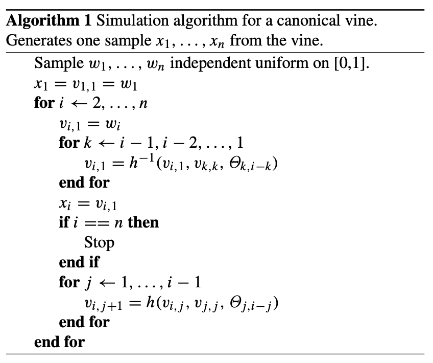
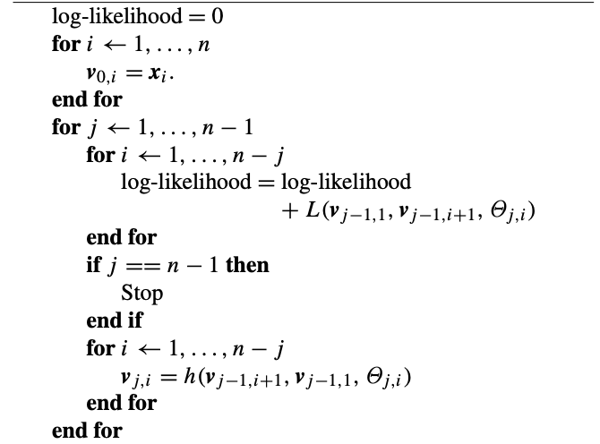

## 1 Introduction
In this report, we refer to the paper by Bruneau et al. <sup>[2](#Bruneau2019)<\sup> to estimate the risk sensitivity of financial assets through multivariate copula. The structure of the report is as follows. First, we analyze the data and build models to realize transforming data from ppf to cdf and the inverse process. Second, we introduce the canonical vine and simulate data from the canonical vine which have the same dependences with our input data as the parameters of the canonical vine are fitted based on the input data. Third, we calculate the Cross Conditional Value at Risk (CVaR).


## 2 Modeling

### 2.1 Copulae

In this section, we basically infer the models from the paper by Aas et al. <sup>[1](#Aas2009)</sup>.

#### 2.1.1 C-Vine

Considering a multivariate cumulated distribution function $F$ of $n$ random variables $\textbf{X}={X_1, ..., X_n}$ with marginals $F_1(x_1), ..., F_n(x_n)$, Skalar's Theorem states that there exists a unique n-dimensional copula $C$ to describte the joint distribution of these these variables. If $F$ is absolutely continuous with strictly increasing and continuous marginal cdf $F_i$, the joint density function $f$ can be written as:

$$
f(x_1, x_2, ..., x_n) = c_{1:n}(F_1(x_1), F_2(x_2), ..., F_n(x_n)) \cdot \prod_{i=1}^{n} f_i(x_i).
$$

which is the product of the n-dimensional copula density $c_{1:n}(\cdot)$ of $C$ and the marginal densities $f_i(\cdot)$.

Building high-dimensional copulae is generally recognized as a challenging task. One of the most popular methods is the pair-copula construction (PCC) proposed by Aas et al. [1]<sup>[1](#Aas2009)</sup>. The idea is to construct a high-dimensional copula by combining bivariate copulae. The basic principle behind PCC is that the density can be factorized as:

$$
f(x_1, x_2, ..., x_n) = f_n(x_n) \cdot f(x_{n-1}|x_n) \cdot f(x_{n-2}|x_{n-1}, x_n) \cdot ... \cdot f(x_1|x_2, ..., x_n). \, \tag{1}
$$

Each term in (1) can be decomposed into the appropriate pair-copula times a conditional marginal density, using the general formula:

$$
f(x| \textbf{v}) = c_{x v_j|\textbf{v}_{-j}}\{F(x|\textbf{v}_{-j}), F(v_j|\textbf{v}_{-j})\} \cdot f_{x}(\textbf{v}_{-j}). 
$$
Here $\textbf{v}$ is a vector of variables, $\textbf{v}_{-j}$ is the vector $\textbf{v}$ with the $j$-th element removed. 

The pair-copula construction involves marginal conditional distribution of the form $F(x|\textbf{v})$. For every $j$ :

$$
F(x|\textbf{v}) = \frac{\partial C_{x v_j|\textbf{v}_{-j}}\{F(x|\textbf{v}_{-j}), F(v_j|\textbf{v}_{-j})\}}{\partial F(v_j|\textbf{v}_{-j})}.
$$

For the special case where $v$ is a univariate, we have:

$$
F(x|v) = \frac{\partial C_{x v}(F(x), F(v))}{\partial F(v)}.
$$

We will use the function $h(x, v, \Theta)$ to represent this conditional distribution function when $x$ and $v$ are uniform:

$$
h(x, v, \Theta) = F(x|v) = \frac{\partial C_{x v}(F(x), F(v))}{\partial F(v)}, \\
\Theta - \text{the set of parameters of the joint distribution function}.
$$

Furture, let $h^{-1}(u, v, \Theta)$ be the inverse of the h-function with respect to $u$, or the equivalently the inverse of the conditional distribution function.

For high-dimension distribution, there are significant number of possible pair-copular. To help organising them, Bedford and Cooke have introduced a graphical model denoted as the regular vine. Here, we concentrate on the special case of regular vines - the canonical vine (C-vine), which gives a specific way of decomposing the density. The figure below shows a C-vine with 5 variables. 


The n-dimensional density corresponding to a C-vine is given by:

$$
\prod_{k=1}^{n} f(x_k) \prod_{j=1}{n-1} \prod_{i=1}^{n-j} c_{i, i+j|1, ..., j-1}\{F(x_j|x_1, ..., x_{j-1}), F(x_{i+j}|x_1, ..., x_{i+j-1})\}.
$$

Fitting a canonical vine might be advantageous when a particular variable is known to be a key variable that governs interaction in the data set. In such a situation one may decide to locate this variable at the root of the canonical vine, as we have done with variable in the figure. 


#### 2.1.2 Conditional independence
Assuming conditional independence may reduce the number of levels of the pair-copula decomposition, and hence simplify the construction. 

In general, for any vector of variables $\textbf{v}$, and two variables $X$ and $Y$, the latter are conditionally independent given $\textbf{V}$ if and only if:

$$
c_{xy|\textbf{v}}\{F(x|\textbf{v}), F(y|\textbf{v})\} = 1.
$$


#### 2.1.3 Simulation from a pair-copula decomposed model
In this section we show the simulation algorithm for canonical vines which follows the method discussed in Bruneau (2019) We assume for simplicity that the margins of the distribution are uniform. 
[^1]: For variables with other marginal distributions, we transform the data to uniform marginals before fitting the vine copula.

To sample n dependent uniform[0, 1] variables, we first sample $w_1, ..., w_n$ independent uniform on [0, 1]. Then set

$$
x_1 = w_1, \\
$$

$$
x2 = F^{-1}(w_2|x_1),\\
$$

$$
x3 = F^{-1}(w_3|x_1, x_2),\\
...\\
$$

$$
x_n = F^{-1}(w_n|x_1, ..., x_{n-1}).\\
$$

To determine the conditional distribution $F^{-1}(w_j|x_1, ..., x_{j-1})$, we use the h-function. 

The algorithm gives the procesdure for sampling from a canonical vine. The outer loop runs over the variables to be sampled. This loop consists of two other for-loops. In the first, the ith varaible is sampled, while in the other, the conditional distribution functions needed for sampling the $(i+1)$th variable are updated. To compute these conditional distribution functions, we repeatedly use the h-function, with previously computed conditional distribution functions, $v_{i,j}=F(x_i|x_1, ..., x_{j-1})$, as the first two arguments. The last argument of the h-function is the parameter $\Theta_{j,i}$ of the corresponding copula density $c_{j,j+i}|1,...,j-1(\cdot, \cdot)$

The algorithm is as follows:




#### 2.1.4 Estimation of the parameters
In this section we describe how the parameters of the canonical vine density are estimated. To simplify the process as mentioned before, we assumme that the marginals are uniform and the the time series is stationary and independent over time. This assumption is not restrictive, as we can always transform the data to uniform marginals before fitting the vine copula. 

We use the maximum likelihood method to estimate the parameters of the canonical vine. Since the actual margins are normally unknown in practice, what is being maximised is a pseudo-likelihood. 

The log-likelihood is given by:

$$
\sum_{j=1}^{n-1} \sum_{i=1}^{n-j} \sum_{t=1}^{T} \log c_{j, j+i|1, ..., j-1}\{F(x_{j,t}|x_{1,t}, ..., x_{j-1,t}), F(x_{i+j,t}|x_{1,t}, ..., x_{j-1,t})\}.
$$


For each copula in the above formula, there is at least one parameter to be determined. The algorithm for estimating the parameters is listed below in the figure. The ourter for-loop corresponds to the outer sum in the pseudo-likelihood. The inner for-loop corresponds to the sum over i. The innermost for-loop corresponds to the sum over the time series. Here, the element t of $textbf{v}_P{j,i}$ is $v_{j, i, t} = F(x_{i+j, t}|x_{1,t},...,x_{j,t})$. $L(\textbf{x}, \textbf{v}, \Theta)$ is the log-likelihood of the chosen bivariate copula with parameters $\Theta$ and the data $\textbf{x}$ and $\textbf{v}$. That is,

$$
L(\textbf{x}, \textbf{v}, \Theta) = \sum_{t=1}^{T} \log c(x_t, v_t, \Theta),\\
c(u, v, \Theta) \text{is the density of the bivariate copula with parameters $\Theta$}.
$$



Starting values of the parameters needed in the numerical maximization of the log-likelihood are determined as follows:

1. Estimate the parameters of the copulae in the first level of the vine tree from the original data.

2. Compute observations for tree 2 using the copula parameters from tree 1 and the h-function.

3. Estimate the parameters of the copulae in the second level of the vine tree from the observations computed in step 2.

4. Repeat steps 2 and 3 until the parameters of all copulae in the vine tree have been estimated.

#### 2.1.5 Copula selection

In the above content, we introduce the canonical vine copula, the calibration of the parameters, and the simulation of the data. However, we didn't specify which copula to use in the pair-copula decomposition. The choice of copula is crucial for the performance of the model. In this section, we discuss the selection of the copulae.


#### 2.1.5.1
The density of the bivariate Gaussian copula is given by：

$$
c(u, v, \theta) = \frac{1}{\sqrt(1-\theta^2)} \exp \{ -\frac{{\theta}^2 (x_1^2 + x_2^2) - 2 \theta x_1 x_2}{2(1-\theta^2)} \}, -1 < \theta < 1.
$$

Here, $\theta$ is the correlation parameter, which is normally denoted as $\rho$. $x_1 = \Phi ^{-1}(u)$, $x_2 = \Phi ^{-1}(v)$, and $\Phi$ is the standard normal distribution function.

The h-function is given by:

$$
h(u, v, \theta) = \Phi(\frac{\Phi^{-1}(u) - \theta \Phi ^{-1}(v)}{\sqrt{1-\theta^2}}).
$$

Suppose the h-function is equal to $w$, then the inverse h-function is given by:

$$
h^{-1}(w, v, \theta) = \Phi\{ \Phi^{-1}(w) \sqrt{1-\theta^2} + \theta \Phi^{-1}(v) \}
$$


#### 2.1.5.3 Clayton copula
The density of Clayton copula is given by:

$$
c(u, v, \theta) = (1 + \theta)(u \cdot v)^{-\theta} - 1) \times (u^{-\theta} + v^{-\theta} - 1)^{-1/\theta - 2}, 0 < \theta < \infty. 
$$

Perfect dependence is obtained when $\theta \rightarrow \infty$, while $\theta \rightarrow 0$ implies independence.

For this copula the h-function is given by:

$$
h(u, v, \theta) = v^{-\theta-1}(u^{-\theta} + v^{-\theta} - 1){-1 - \theta}.
$$

Suppose the h-function is equal to $w$, then the inverse h-function is given by:

$$
h^{-1}(w, v, \theta) = \{(w \cdot v^{\theta+1})^{\frac{\theta}{\theta+1}} + 1-v^{-\theta}\}^{-1/\theta}.
$$


#### 2.1.5.4 Gumbel copula 
The density of Gumbel copula is given by:

$$
c(u, v, \theta) = C_{uv}(u, v)(uv)^{-1} \\
\times \{(-log u)^{\theta} + (-log v)^{\theta}\}^{-2+2/\theta} \\
\times (log u \times log v)^{\theta-1} \\
\times \{ 1 + (\theta - 1) ((-log u)^{\theta} + (-log v)^{\theta})^{-1/\theta}\}, \theta \geq 1.
$$

where $C_{uv}(u, v) = exp \{ -\{(-log u)^{\theta} + (-log v)^{\theta} \}^{1/\theta}\}$. 

Perfect dependence is obtained when $\theta \rightarrow \infty$, while $\theta = 1$ implies independence.

For this copula the h-function is given by:

$$
h(u, v, \theta) = C_{uv}(u,v) \cdot \frac{1}{v} \cdot (-log v)^{\theta - 1} \times \{(-log u)^{\theta} + (-log v)^{\theta} \}^{1/\theta-1}.
$$

Here the inverse h-function must be obtained numerically using the Newton-Raphson method.


In canonical vine, we can use different copulae in the pair-copula decomposition. However, we use single copula type in the pair-copula decomposition in our project to simmplify the process. 

### 2.2 Distribution of the data


### 2.3 CCVaR


## 3 Implementation
### 3.1 Data

### 3.2 Code

#### 3.2.1 Distribution


#### 3.2.2 CVine
In this code, we use the class `CVine` to realize the canonical vine copula. Basically, the class involves the following methods:

1. `build_tree()` - to build the tree structure of the canonical vine copula. This method will fill the class attribute `tree` with the tree structure. 

2. `fit()` - to fit the canonical vine copula to the data. This method will estimate the parameters of the copulae in the vine tree, which will call the method `get_likelihood()` to calculate the log-likelihood of the tree. Here, we use `scipy.optimize.minimize` to maximize the log-likelihood.

3. `simulate()` - to simulate data from the canonical vine copula. This method will simulate data from the fitted vine copula. In this algorithm, we generate independent uniform random variables and then use the algorithm mentioned in Section 2 to generate dependent uniform random variables.

### 3.3 Results


## 4 Conclusion


## References

<a id="Aas2009"></a> [1] Aas, K., Czado, C., Frigessi, A., and Bakken, H. (2009). Pair-copula constructions of multiple dependence. Insurance: Mathematics and Economics, 44(2), 182-198. 

<a id="Bruneau2019"></a> [2] Catherine Bruneau, Alexis Flageollet, and Zhun Peng. (2019). VineCopula: Statistical Inference of Vine Copulas. R package version 2.0.0. https://CRAN.R-project.org/package=VineCopula


## Appendix
### A Code

#### A.1 CVine

```python


```


