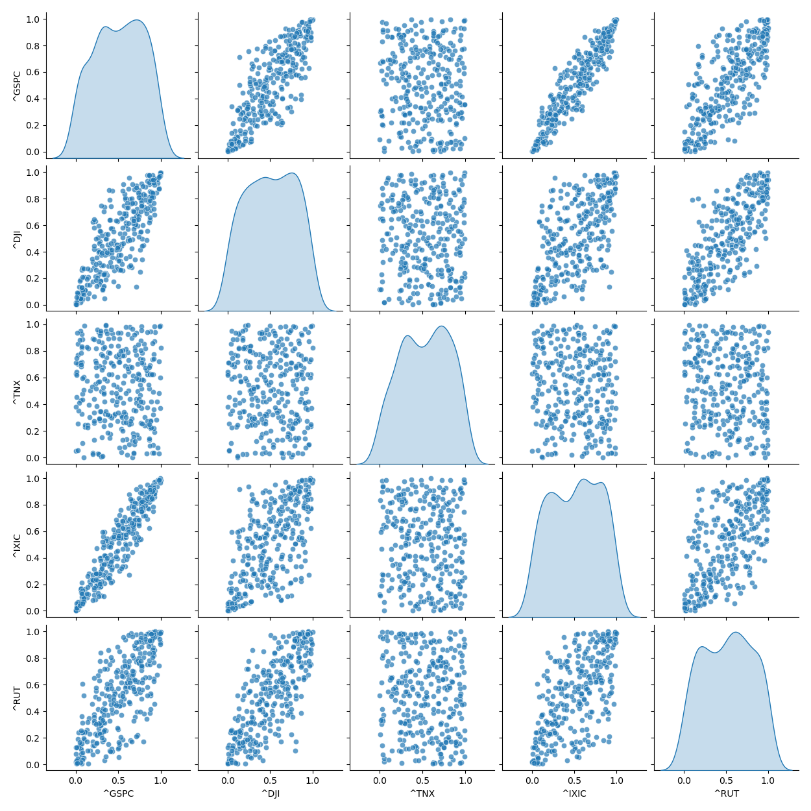

## 1 Introduction

In this report, we refer to the paper by Bruneau et al.<sup>[2](#Bruneau2019)</sup>
to estimate the risk sensitivity of financial assets through multivariate copula. The structure of the report is as follows. First, we analyze the data and build models to realize transforming data from ppf to cdf and the inverse process. Second, we introduce the canonical vine and simulate data from the canonical vine which have the same dependences with our input data as the parameters of the canonical vine are fitted based on the input data. Third, we calculate the Cross Conditional Value at Risk (CCVaR).


## 2 Modeling
### 2.1 Pair Copula

In this section, we basically refer to the models of the paper by Aas et al. <sup>[1](#Aas2009)</sup>.

#### 2.1.1 C-Vine

Considering a multivariate cumulative distribution function $F$ of $n$ random variables $\textbf{X}=({X_1, ..., X_n})$ with marginal cumulative distributions $F_1(x_1), ..., F_n(x_n)$, Skalar's Theorem states that there exists a unique n-dimensional copula $C$ to describte the joint distribution of these these marginals, which is defined as:

$$
F(x_1, x_2, ..., x_n) = C(F_1(x_1), F_2(x_2), ..., F_n(x_n)).
$$

Here, let $F_i(x_i)=u_i$, the copula $C$ can be written as:

$$
C(u_1, u_2, ..., u_n) = F(F_1^{-1}(u_1), F_2^{-1}(u_2), ..., F_n^{-1}(u_n)).
$$

If $F$ is absolutely continuous with strictly increasing and continuous marginal cdf $F_i$, the joint density function $f$ can be written as:

$$
f(x_1, x_2, ..., x_n) = c_{1:n}(F_1(x_1), F_2(x_2), ..., F_n(x_n)) \cdot \prod_{i=1}^{n} f_i(x_i).
$$ 

which is the product of the n-dimensional copula density $c_{1:n}(\cdot)$ of $C$ and the marginal densities $f_i(\cdot)$.

Building high-dimensional copulae is generally recognized as a challenging task. One of the most popular methods is the pair-copula construction (PCC) proposed by Aas et al. <sup>[1](#Aas2009)</sup>. The idea is to construct a high-dimensional copula by combining bivariate copulae. The basic principle behind PCC is that the density can be factorized as:

$$
f(x_1, x_2, ..., x_n) = f_n(x_n) \cdot f(x_{n-1}|x_n) \cdot f(x_{n-2}|x_{n-1}, x_n) \cdot ... \cdot f(x_1|x_2, ..., x_n). \, \tag{1}
$$

In a bivariate case, the density function is defined as:

$$
f(x_1, x_2) = c_{12} \{ F_1(x_1), F_2(x_2)\} \cdot f_1(x_1) \cdot f_2(x_2).
$$

For a conditional density, it follows that:

$$
f(x_1|x_2) = c_{12}(F_1(x_1), F_2(x_2)) \cdot f_1(x_1).
$$

For case with three random variables, the conditional density is given by:

$$
f(x_1|x_2, x_3) = c_{13|2}\{F(x_1|x_2), F(x_3|x_2)\}\cdot f(x_1|x_2) \\
$$

$$
= c_{13|2}\{F(x_1|x_2), F(x_3|x_2)\}\cdot c_{12}(F(x_1), F(x_2)) \cdot {f(x_1)}.
$$

where two pair-copulae are involved.

Based on the above, we can see each term in (1) can be decomposed into the appropriate pair-copula times a conditional marginal density, using the general formula:


$$
f(x| \textbf{v}) = c_{x v_j|\textbf{v}_{-j}}\{F(x|\textbf{v}_{-j}), F(v_j|\textbf{v}_{-j})\} \cdot f_{x}(\textbf{v}_{-j}). 
$$

Here $\textbf{v}$ is a vector of variables, $\textbf{v}_{-j}$ is the vector $\textbf{v}$ with the $j$-th element removed. 

The pair-copula construction involves marginal conditional distribution of the form $F(x|\textbf{v})$. Joe <sup>[4](#Joe1996)</sup> showed that, for every $j$ :

$$
F(x|\textbf{v}) = \frac{\partial C_{x v_j|\textbf{v}_{-j}}\{F(x|\textbf{v}_{-j}), F(v_j|\textbf{v}_{-j})\}}{\partial F(v_j|\textbf{v}_{-j})}.
$$

where $C_{ij|\textbf{v}}$ is a bivariate copula distribution function. d

For the special case where $v$ is a univariate, we have:

$$
F(x|v) = \frac{\partial C_{x v}(F(x), F(v))}{\partial F(v)}.
$$

We will use the function $h(x, v, \Theta)$ to represent this conditional distribution function when $x$ and $v$ are uniform, which is defined as:

$$
h(x, v, \Theta) = F(x|v) = \frac{\partial C_{x v}(F(x), F(v))}{\partial F(v)}, \\
$$


$$
\Theta - \text{the set of parameters of the joint distribution function}.
$$

where the second parameter of $h(\cdot)$ always corresponds to the conditioning variable and $\Theta$ denotes the set of parameters for the copula of the joint distribution function of $x$ and $v$. 


Furture, let $h^{-1}(u, v, \Theta)$ be the inverse of the h-function with respect to $u$, or the equivalently the inverse of the conditional distribution function.

For high-dimension distribution, there are significant number of possible pair-copular. To help organising them, Bedford and Cooke <sup>[5](#Cooke2001)</sup> have introduced a graphical model denoted as the regular vine. Here, we concentrate on the special case of regular vines - the canonical vine (C-vine), which gives a specific way of decomposing the density. The figure below cited from Czado and Naglar <sup>[3](#Czado)</sup> shows a C-vine with 5 variables. In a canonical vine tree all layers are stars: in every layer of the tree there is a single node, called the root, that is connecting all the others. In this figure, the root nodes are $1, (1, 4), (6, 4;1), (6,2;4,1), (5,2;6,4,1)$. [^1] Since all indices from previous root nodes are contained in the label of later root nodes, we can also specify the order by only referencing the index that enters in the next layer. For example the root node sequence in this figure can be written as $1, 4, 6, 2, 5, 3$.

[^1]: In the code, we call the root here as central node. 


\newpage

Based on the factorization discussed above, the n-dimensional density corresponding to a C-vine is given by:

$$
\prod_{k=1}^{n} f(x_k) \prod_{j=1}^{n-1} \prod_{i=1}^{n-j} c_{j, j+i|1, ..., j-1}\{F(x_j|x_1, ..., x_{j-1}), F(x_{j+i}|x_1, ..., x_{j+i-1})\}.
$$

Fitting a canonical vine might be advantageous when a particular variable is known to be a key variable that governs interaction in the data set. In such a situation one may decide to locate this variable at the root of the canonical vine, as we have done with variable in the figure. 

#### 2.1.2 Simulation from a pair-copula decomposed model

In this section we show the simulation algorithm for canonical vines which follows the method discussed in Aas <sup>[1](#Aas2019)</sup>.
We assume for simplicity that all the margins of the distribution are uniform. [^2]


[^2]: For variables with other marginal distributions, we transform the data to uniform marginals before fitting the vine copula.

To sample n dependent uniform[0, 1] variables, we first sample $w_1, ..., w_n$ independent uniform on [0, 1] and the variables $x_1, ..., x_n$ are generated by applying successive inverse cumulative distribution functions. We refer to the method mentioned by Cooke <sup>[6](#Cooke2007)</sup>. $w_1,...,w_n$ are values of $x_1, F(x_2|x_1), F(x_3|x_1, x_2), ... , F(x_n|x_1, x_2, ..., x_{n-1}$ respectively. And conditional distributions $F(x_n|x_1), F(x_n|x_1, x_2),...,F(x_n|x_1, x_2, ..., x_{n-1})$ can be found by conditionalizing copulae. Inverting the value of $w_n$ through $F(x_n|x_1), F(x_n|x_1, x_2), ... , F(x_n|x_1, x_2, ... , x_{n-1}$ gives $x_n$.
This process is illustrated in the Cooke's figure below:


\newpage


Sample $x_n$ as follows:

$$
x_n = F^{-1}_{x_n|x_1}(F^{-1}_{x_n|x_1,x_2}(...(F^{-1}_{x_n|x_1,...,x_{n-1}}(w_n))...)).
$$

As we mentioned before, the conditional distribution functions $F(x_i|x_1, ..., x_{i-1})$ can be computed by the h-function. Therefore, the algorithm is also <sup>[1](#Aas2009)</sup> for sampling from a canonical vine is as follows:


\newpage

The outer loop runs over the variables to be sampled. This loop consists of two other for-loops. In the first, the ith varaible is sampled, while in the other, the conditional distribution functions needed for sampling the $(i+1)$th variable are updated. To compute these conditional distribution functions, we repeatedly use the h-function, with previously computed conditional distribution functions, $v_{i,j}=F(x_i|x_1, ..., x_{j-1})$, as the first two arguments.The last argument of the h-function is the parameter $\Theta_{j,i}$ of the corresponding copula density $c_{j,j+i}|1,...,j-1(\cdot, \cdot)$. 
The actually work flow for each loop is as follows(taking $i=n$ as example):

$$
h^{-1}(v_{n,1}, v_{n-1, n-1}, \Theta{n-1,1}) \\
$$

$$
=h^{-1}(w_i, F(x_{n-1}|x_1, ..., x_{n-2}), \Theta_{n-1,1}) \\
=F(x_n|x_1, ..., x_{i-2}).
$$

$$
h^{-1}{v_{n,1}, v_{n-2, n-2}, \Theta{n-2, 2}} \\
$$

$$
= h^{-1}(F(x_n|x_1, ..., x_{n-2}), F(x_{n-1}|x_1, ..., x_{n-3}), \Theta_{n-2, 2}) \\
$$

$$
= F(x_n|x_1, ..., x_{n-3}).
$$

$$
...

$$

$$
h^{-1}(v_{n,1}, v_{1, 1}, \Theta_{1, n-1}) \\
$$

$$
= h^{-1}(F(x_n|x_1), x_1, \Theta_{1, n-1}) = F(x_n).
$$


\newpage


#### 2.1.3 Estimation of the parameters

In this section we describe how the parameters of the canonical vine density are estimated. To simplify the process as mentioned before, we assumme that the marginals are uniform and the the time series is stationary and independent over time. This assumption is not limiting, as we can always preprocess the data through models such as ARIMA and GARCH to make the input of the canonical vine model stationary. 

We use the maximum likelihood method to estimate the parameters of the canonical vine. Since the actual margins are normally unknown in practice, what is being maximised is a pseudo-likelihood. 


The log-likelihood is given by:

$$
\sum_{j=1}^{n-1} \sum_{i=1}^{n-j} \sum_{t=1}^{T} \log c_{j, j+i|1, ..., j-1}\{F(x_{j,t}|x_{1,t}, ..., x_{j-1,t}), F(x_{i+j,t}|x_{1,t}, ..., x_{j-1,t})\}.
$$

For each copula in the above formula, there is at least one parameter to be determined. The algorithm for estimating the parameters is listed below in the figure. The ourter for-loop corresponds to the outer sum in the pseudo-likelihood. The inner for-loop corresponds to the sum over i. The innermost for-loop corresponds to the sum over the time series. Here, the element t of $textbf{v}_{j,i}$ is $v_{j, i, t} = F(x_{i, t}|x_{1,t},...,x_{j,t})$. $L(\textbf{x}, \textbf{v}, \Theta)$ is the log-likelihood of the chosen bivariate copula with parameters $\Theta$ and the data $\textbf{x}$ and $\textbf{v}$. That is,

$$
L(\textbf{x}, \textbf{v}, \Theta) = \sum_{t=1}^{T} \log c(x_t, v_t, \Theta),\\
c(u, v, \Theta) \text{is the density of the bivariate copula with parameters $\Theta$}.
$$


\newpage

Starting values of the parameters needed in the numerical maximization of the log-likelihood are determined as follows:

1. Estimate the parameters of the copulae in the first level of the vine tree from the original data.

2. Compute observations for level 2 using the copula parameters from level 1 and the h-function.

3. Estimate the parameters of the copulae in the second level of the vine tree from the observations computed in step 2.

4. Repeat steps 2 and 3 until the parameters of all copulae in the vine tree have been estimated.

#### 2.1.4 Copula selection

In the above content, we introduce the canonical vine copula, the calibration of the parameters, and the simulation of the data. However, we didn't specify which copula to use in the pair-copula decomposition. The choice of copula is crucial for the performance of the model. We only show the Gaussian copula and Clayton copula in the following content. However, the C-Vine structure can be easily extended to other copulae through getting copula functions and h-functions.


#### 2.1.4.1 Gaussian copula

The density of the bivariate Gaussian copula is given by:

$$
c(u, v, \theta) = \frac{1}{\sqrt(1-\theta^2)} exp \{ -\frac{{\theta}^2 (x_1^2 + x_2^2) - 2 \theta x_1 x_2}{2(1-\theta^2)} \}, -1 < \theta < 1.
$$

Here, $\theta$ is the correlation parameter, which is normally denoted as $\rho$. $x_1 = \Phi ^{-1}(u)$, $x_2 = \Phi^{-1}(v)$, and $\Phi$ is the standard normal distribution function.

The h-function is given by:

$$
h(u, v, \theta) = \Phi(\frac{\Phi^{-1}(u) - \theta \Phi^{-1}(v)}{\sqrt{1-\theta^2}}).
$$

Suppose the h-function is equal to $w$, then the inverse h-function is given by:

$$
h^{-1}(w, v, \theta) = \Phi\{ \Phi^{-1}(w) \sqrt{1-\theta^2} + \theta \Phi^{-1}(v) \}
$$


#### 2.1.4.2 Clayton copula

The density of Clayton copula is given by:

$$
c(u, v, \theta) = (1 + \theta)(u \cdot v)^{-\theta} - 1) \times (u^{-\theta} + v^{-\theta} - 1)^{-1/\theta - 2}, \theta \in [-1, \infty) \ 0. 
$$

Perfect dependence is obtained when $\theta \rightarrow \infty$.

For this copula the h-function is given by:

$$
h(u, v, \theta) = v^{-\theta-1}(u^{-\theta} + v^{-\theta} - 1){-1 - \theta}.
$$

Suppose the h-function is equal to $w$, then the inverse h-function is given by:

$$
h^{-1}(w, v, \theta) = \{(w \cdot v^{\theta+1})^{\frac{\theta}{\theta+1}} + 1-v^{-\theta}\}^{-1/\theta}.
$$

### 2.2 Gaussian Copula
A Gaussian Copula that the dependency structure between the multiple random variavles is Gaussian dependency. We introduce Gaussian Copula here to compare it with CVine.

#### 2.2.1 Mathematical Representation
Let $\Phi$ be the standard normal CDF and $\Phi_{\Sigma}$ is the CDF of a multivariate normal distribution with correlation matrix $\Sigma$. For random variables $(U_1, U_2, \ldots, U_d)$ with uniform marginals, the Gaussian Copula $(C)$ is defined as:

$$
C(u) = \Phi_{\Sigma}(\Phi^{-1}(u_1), \Phi^{-1}(u_2), \ldots, \Phi^{-1}(u_d))
$$

#### 2.2.2 Cholesky Decomposition
Cholesky decomposition is a matrix factorization technique used for symmetric, positive-definite matrix. It expresses a matrix as the product of a lower triangular matrix and its transpose.

Given a symmetric, positive-definite matrix $A$, the Cholesky decomposition finds a upper triangular matrix $U$ such that:

$$
A = LL^\top
$$

where:
- $L$ is a lower triangular matrix with real, positive diagonal entries.
- $L^\top$ is the transpose of $L$.

The algorithm is as follows:
1. For a given matrix $A$, calculate each element of $L$ using:
   $$
   L_{i,i} = \sqrt{A_{i,i} - \sum_{k=1}^{i-1} L_{i,k}^2}
   $$
   $$
   L_{i,j} = \frac{1}{L_{j,j}} \left( A_{i,j} - \sum_{k=1}^{j-1} L_{i,k} L_{j,k} \right), \quad \text{for } i > j
   $$
2. Fill the matrix $L$ row by row.

#### 2.2.3 Steps to Build a Gaussian Copula

1. Define the correlation matrix.

2. Use Cholesky decomposition to decompose the correlation matrix.

3. Generate independent standard normal random variables.

4. Apply the decomposed matrix on these random variables to get correlated random variables.

5. Map the random variables to uniform distributions by calculating their cumulative distribution function.


#### 2.2.4 Comparison between Gaussian Copula and CVine
In Gaussian Copula, the dependency is captured by a correlation matrix, while in CVne we models dependencies pairwisely. Here are some main difference between these two methods.

1. Gaussian Copula qssumes symmetric Gaussian dependency, which may not adequately represent tail dependencies. It underestimates the probability of extreme co-movements.

2. In CVine, dependency is modeled with separate copulas, allowing for different types of relationships between variables. CVine can capture asymmetric dependencies and tail dependencies more effectively.

3. Gaussian Copula only requires the Cholesky decomposition of the correlation matrix. So, the computation is flexible. However, CVine Copula More computationally intensive. It requires constructing and evaluating multiple pair-copulas and dependency trees.


### 2.3 CCVaR

The Cross Conditional Value at Risk (CCVaR) quantifies the expected return of an asset under the extreme conditions of a given risk factor. For an asset $R_i$ and a risk factor $X$, the CCVaR at confidence level $\alpha$ is defined as:

$$
CCVaR_\alpha(R_i \mid X; F_X) = \mathbb{E}[R_i \mid F_X(X) \leq \alpha],
$$

where:

$$
F_X(X): \text{ the cumulative distribution function (CDF) of the risk factor } X,
$$

$$
\alpha: \text{ the confidence level defining the extreme quantile (e.g., } \alpha = 0.05 \text{ for the worst 5 \%)}.
$$

\newpage

## 3 Implementation

### 3.1 Data

### 3.2 Code
#### 3.2.1 Data Fetcher
1. **`__init__(self, tickers: list, start_date: datetime, end_date: datetime)`** - This method initializes the `DataFetcher` object. It takes in three arguments: 
   - `tickers`: a list of stock or index tickers,
   - `start_date`: the start date for fetching historical data,
   - `end_date`: the end date for the data fetching period. 

2. **`fetch_and_save_data(self)`** - It uses `yfinance` to download the adjusted closing prices for each ticker between the specified `start_date` and `end_date`. The downloaded data is then forward-filled for any missing values and saved to the CSV file. Finally, it computes the percentage change of the adjusted closing prices, dropping any rows with missing values.

3. **`plot_distribuion(self)`** - This method generates and displays histograms of the return distributions for each ticker in the `tickers` list.

Here， we choosed a list of tickers (tickers = ['^GSPC', '^DJI', '^TNX', '^IXIC', '^RUT']), representing the five financial instruments of S&P 500 Index, Dow Jones Industrial Average, CBOE 10-Year Treasury Note Yield, NASDAQ Composite Index and Russell 2000 Index. The start date of our data is set to January 1st, 2023, and the end date is set to November 1st, 2024. Using these parameters, we fetched historical market data of indices from Yahoo Finance. Then, we calculated the return of these indices and dropped invalid data as the input of our model.

#### 3.2.2 Distribution
In this code, the `Multivariate` class is designed to perform various multivariate statistical operations on a given dataset. The class includes methods for calculating empirical cumulative distribution functions (ECDF), empirical percent-point functions (PPF), extreme value correlation, and visualization of data through heatmaps and kernel density estimation (KDE) plots. The main methods in the class are:

1. **`__init__(self, data)`** - This is the initialization method of the `Multivariate` class. It takes a `data` argument. The method calculates and stores the covariance and correlation matrices of the data.

2. **`empircal_cdf(self)`** - This method computes the empirical cumulative distribution function (ECDF) for each column of the dataset. The ECDF is calculated by ranking the values in each column and dividing by the total number of data points. The result is stored in the `self.ecdf` attribute, and the method prints the rank of the data along with its length for verification. It returns the calculated ECDF values.

3. **`empircal_ppf(self, u)`** - This method calculates the empirical percent-point function (PPF) for a given set of quantiles (`u`). It iterates through each column in the data and computes the quantile value at the corresponding position in `u` for each column. The method returns an array of PPF values, which are the inverse of the ECDF.

4. **`extreme_value_correlation(df, percentile=95, direction="upper")`** - This static method computes the extreme value correlation for a dataset by analyzing the tail behavior of the data. It first calculates the threshold for each column at a given percentile. It then calculates the correlation of extreme values by checking how often two columns both exceed their respective thresholds (upper or lower). The result is returned as a correlation matrix showing the conditional probability of extreme values occurring together for each pair of columns.

5. **`heatmap(data, title)`** - This static method generates a heatmap visualization for the given data. It creates a heatmap from the data which can be used to visualize the relationships or correlations between different variables in the dataset.

6. **`plot_kde_comparison(df, title)`** - This method creates a pairplot to compare the kernel density estimates (KDE) of the variables. The pairplot visualizes both scatter plots and KDEs on the diagonal. This method is useful for understanding the pairwise relationships and distributions of variables in the dataset.

#### 3.2.3 CVine

In this code, we use the class `CVine` to realize the canonical vine copula. Basically, the class involves the following methods:

1. **build_tree()** - to build the tree structure of the canonical vine copula. This method will fill the class attribute `tree` with the tree structure. 

2. **fit()** - to fit the canonical vine copula to the data. This method will estimate the parameters of the copulae in the vine tree, which will call the method `get_likelihood()` to calculate the log-likelihood of the tree. Here, we use `scipy.optimize.minimize` to maximize the log-likelihood.

3. **simulate()** - to simulate data from the canonical vine copula. This method will simulate data from the fitted vine copula. In this algorithm, we generate independent uniform random variables and then use the algorithm mentioned in Section 2 to generate dependent uniform random variables.

### 3.2.3 Gaussian Copula
In this code, we use the class `GaussianCopula` to implement a Gaussian copula for modeling dependencies between multiple variables. The class involves several key methods, each performing distinct tasks in the copula modeling process:

1. **estimate_paras()** - This method estimates the parameters (mean and standard deviation) for each variable in the dataset. It calculates the mean (`miu`) and standard deviation (`sigma`) for each variable in the dataset and stores these parameters in the `parameter_dict` attribute. These parameters are essential for understanding the marginal distributions of the individual variables before applying the copula.

2. **estimate_corr()** - This method estimates the correlation matrix from the dataset. It first centers the data by subtracting the mean of each variable and then computes the covariance matrix. The covariance matrix is normalized by dividing by the product of the standard deviations of the variables to obtain the correlation matrix. This matrix captures the dependencies between the variables, which will later be used to introduce correlation in the simulated data.

3. **generate_samples(n_samples)** - This method generates samples from the fitted Gaussian copula. It first creates independent random variables using the `generate_normal_bm` function, which generates standard normal random variables using the Box-Muller method. Then, it applies the Cholesky decomposition to the correlation matrix to introduce the dependency structure between the variables. The uncorrelated normal variables are multiplied by the Cholesky factor, resulting in correlated normal variables. These are then transformed into uniform random variables using the cumulative distribution function (CDF) of the normal distribution. Finally, the uniform random variables are mapped back to the marginal distributions using the inverse cumulative distribution (quantile function), generating correlated sample returns from the copula.


#### 3.2.4 CCVar

In this section, we describe the code implementation of CCVaR using Python. The implementation is encapsulated in the `CCVaR` class, which contains methods to calculate CCVaR for single asset-factor pairs and generate a CCVaR matrix for all assets and factors.

1. **Initialization**: The `__init__` method initializes the CCVaR model by taking the following inputs:

- `data`: Asset return matrix ($T \times N$).
- `factors`: Risk factor matrix ($T \times F$).
- `alpha`: Confidence level for defining extreme conditions.

2. **Data Transformation**: The `_transform_to_uniform` method transforms raw data to the uniform space $[0, 1]$ using the empirical cumulative distribution function (CDF).

3. **Extreme Event Identification**: The `_get_extreme_indices` method identifies indices corresponding to extreme events, where the risk factor falls below the $\alpha$-quantile.

4. **Single CCVaR Calculation**: The `calculate_ccvar` method computes CCVaR for a single asset with respect to a specific risk factor.

5. **CCVaR Matrix Calculation**: The `calculate_all_ccvar` method generates a matrix of CCVaR values for all assets and risk factors.

6. **Result Summarization**: The `summarize_results` method outputs the CCVaR matrix with labels for assets and factors.

\newpage


### 3.3 Results

#### 3.3.1 Distribution


#### 3.3.2 CVine and Multivariate Gaussian Copula
We test the `CVine` and `GaussianCopula`based on the return data of the assets. 

We first show the correlation matrix of the returns of our initial data and the correlation of the returns of the simulated data from CVine (Gaussian copula and Clayton copula) and Multivariate Gaussian Copula. The results are shown below:


\newpage


\newpage


\newpage


\newpage

Basically, the correlation matrix of the returns of the simulated data from the copulae is similar to the correlation matrix of the returns of the initial data. However, we can see that the level of Pearson correlation is different. 

Then we show the scatter plot of the returns of the initial data and the scatter plot of the returns of the simulated data from CVine and Gaussian Copula. The results are shown below: 


\newpage



\newpage


\newpage


\newpage

We can see that the scatter plot of the returns of the simulated data from the copulae is basically similar to the scatter plot of the returns of the initial data, which means the copulae can capture the dependence structure of the data. However, the correlation of the simulated results may perform differently from the initial data when the assets don't have clear correlation structure.


Finally, we test the extreme dependence between the returns of the assets as the Clayton copula should have reflected the lower tail dependence. We simply calculate a matrix to evaluate the level of extreme dependence between the returns of the assets. For the value in i-th row and j-th column, it is the probability that the return of the j-th asset is below the 5% quantile given the return of the i-th asset is below the 5% quantile. The results are shown below:


\newpage

In CVine, the average value of the Clayton copula is higher than the Gaussian copula, which means the Clayton copula has a higher level of extreme dependence between the returns of the assets.

In Multivariate Gaussian Copula, we get a even higher correlation. It may mean that the Multivariate Gaussian Copula overestimates linear dependency between variables.

Our results shows that CVine are more applicable in more complex dependent relationships.


#### 3.3.3 CCVaR

\newpage

## 4 Conclusion

The canonical vine copula is a powerful tool for modeling the dependence structure of multivariate data. In this report, we have introduced the canonical vine copula and its application in estimating the risk sensitivity of asset portfolios. We have implemented the canonical vine copula in Python and demonstrated its use in simulating data and estimating the parameters of the copulae. Besides, we compared our results of CVine and Multivariate Gaussian Copula and find that CVine is more useful in depicting non-linear relationships. We have also implemented the Cross Conditional Value at Risk (CCVaR) to quantify the expected return of an asset under extreme conditions of a given risk factor. The CCVaR provides a useful measure of the risk sensitivity of asset portfolios to different risk factors. Further research can explore the application of the canonical vine copula in asset portfolio optimization and risk management. The drawbacks of our implementation include that we have not compare the results of different copulae and simply assume returns follow Gaussian Copula. 

\newpage

## References

<a id="Aas2009"></a> [1] Aas, K., Czado, C., Frigessi, A., and Bakken, H. (2009). Pair-copula constructions of multiple dependence. Insurance: Mathematics and Economics, 44(2), 182-198. 

<a id="Bruneau2019"></a> [2] Catherine Bruneau, Alexis Flageollet, and Zhun Peng. (2019). Vine Copula Based Modeling.  

<a id="Czado"></a> [3] Claudia Czado and Thomas Naglar. (2021). Vine copula based modeling.

<a id="Joe1996"></a> [4] Joe, H., 1996. Families of m-variate distributions with given marginals and bivariate dependence parameters.

<a id="Cooke2001"></a> [5] Bedford, T., Cooke, R.M., 2001b. Probability density decomposition for conditionally dependent random variables modeled by vines. Annals of Mathematics and Artificial Intelligence 32, 245–268.

<a id="Cooke2007"></a> [6] D. Kurowicka, R.M. Cooke, Sampling algorithms for generating joint uniform distributions using the vine-copula method, Computational Statistics & Data Analysis, Volume 51, Issue 6, 2007, Pages 2889-2906, ISSN 0167-9473, https://doi.org/10.1016/j.csda.2006.11.043.

## Appendix
### A Code

#### A.1 CVine

```python

import numpy as np
from scipy.optimize import minimize
from copula import Clayton, Gaussian

class CVine(object):
    layer = {"root": [], 
             # list of root nodes.
             #ex. in F(u1, u2|v), v is the root node 
             "parentnode": {},
             # index of nodes in last level. 
             # ex. {1: (1,2)} means the node 1 in this tree level 
             # got from the node pair (1,2) in last level
             "node": [], 
             # index of the nodes. 
             # from 0 to l. this is not the initial index.
             "pair": [],
             # list of node pairs in the tree,
             # ex. in F(u1, u2|v), (u1, u2) is a node pair. 
             # here the node pair is the index of nodes in the root,
             #which is different from the "node". 
             "level": 0, 
             # level of the tree (k). 
             # 0-root, 1-1st level, 2-2nd level, ...
             "nodenum": 0, 
             # number of the nodes in this tree (l). 
             # equal to n - k 
             "edgenum": 0, 
             # number of the edges in this tree.
             # equal to l as our node number is
             # the actual number minus1.
             "V": None,  
             # h functions in this level. 
             #V[:, j] is the h function of node j.
             }    

    tree = {"thetaMatrix": None,
            # copula parameter matrix in this level.
            # it is a upper matrix. thetaMatrix[i, j] is 
            # the copula parameter in level j 
            # between node 1 and node i+1. 
            "structure": {}, 
            # the tree structure in this level.
            # the key is the node index, 
            # the value is layer.
            "depth": 0, 
            # the depth of the tree, 
            # 0 means only has root. 
            }

    def __init__(self, U, copulaType="Clayton"):
        
        """
        U: np.array, data matrix. 
        follows uniform distribution

        """
        self.U = U
        self.T = U.shape[0]
        self.variable_num = U.shape[1] - 1 
        # to make the structure more clear, 
        # all the variables are indexed from 0. 
        # Therefore, when the variable_num is n,
        # we actually have n+1 variables x0, x1, ..., xn.
        if copulaType == "Clayton":
            self.copula = Clayton()
        elif copulaType == "Gaussian":
            self.copula = Gaussian()

        else:
            raise ValueError("The copula type\
                             is not supported.")

        self.max_depth = self.variable_num  
        # todo: the max_depth is not implemented yet.
        
    def build_tree(self):
        """
        build the tree structure. 
        """
        self.build_root()
        while self.tree["depth"] < self.max_depth:
            self.build_kth_tree()

    def build_root(self):
        """
        build the root of the tree. the root is basically 
        """
        
        layer = self.layer.copy()
        layer["level"] = 0
        layer["V"] = self.U.copy() 
        # the F(x|v) in the first layer 
        # is the empirical cdf of x. 
        layer["nodenum"] = self.variable_num
        layer["edgenum"] = self.variable_num 
        layer["node"] = list(range(0, layer["nodenum"] + 1))
        self.tree["structure"][0] = layer

        
    def build_kth_tree(self):
        """
        build the kth tree. 
        """

        if self.tree["depth"] >= self.variable_num:
            print("The tree depth is already the maximum.")

        last_layer =\
         self.tree["structure"][self.tree["depth"]]

        layer = self.layer.copy()
        layer["level"] = \
         last_layer["level"] + 1
        layer["nodenum"] =\
         last_layer["nodenum"] - 1
        layer["edgenum"] = layer["nodenum"]
        layer["node"] = \
        list(range(0, layer["nodenum"]+ 1))
        (layer["pair"], layer["node"], \
         layer["parentnode"], layer["root"]) = \
        self.pair_nodes(last_layer)
        self.tree["structure"][layer["level"]] = layer
        self.tree["depth"] = self.tree["depth"] + 1
    
    def pair_nodes(self, last_layer):
        """
        pair the nodes in this layer. 
        here we use the first node in each level 
        as the new central node and combine it 
        with the root in last level to get the new root. 
        This process is same as the process we show in the report.
        """


        nodes = range(0, last_layer["nodenum"] + 1)

        if last_layer["level"] == 0: 
            # the second layer is not conditional copula,
            # so we just combine the center node with 
            # neighor nodes without any condition.
            pair_left = last_layer["node"][0]
            pairs = tuple(zip(last_layer["edgenum"] * \
                              [pair_left], 
                              last_layer["node"][1:]))
            parentnodes = dict(zip(nodes, pairs))
            dependent = np.empty(last_layer["nodenum"] + 1)
            return (pairs, 
                   nodes, 
                   parentnodes, 
                   [])
        else:
            pairs = []
            parentnodes = {}
            last_pairs = last_layer["pair"]
            
            common_node = last_pairs[0][0] 
            # set the first node as center node in each layer.

            new_root = \
            last_layer["root"] + [common_node]
            pair_left = last_pairs[0][1] 
            # the right element in the center pair will be
            # the left element in pairs in this layer. 
            for i in range(1, last_layer["nodenum"] + 1):
                pairs.append(tuple((pair_left, last_pairs[i][1])))
                parentnodes[i-1] = (0, i)  
                # the i-1th node in this layer is from 
                # the pair (0, i) in last layer. ex.
                # the first layer in the second layer is
                # from the node pair (0, 1) in the first layer.   
        return (pairs, 
                nodes,
                parentnodes, 
                new_root)


    def fit(self):
        """
        fit the vine tree model by maximizing 
        the likelihood of the whole tree.

        """
        paramNum =\
        sum([self.tree["structure"][layer]["edgenum"] \
             for layer in range(0, self.tree["depth"])])

        thetaParams = np.ones(paramNum) * 0.5
        bounds = [self.copula.bound] * paramNum
        result = minimize(self.get_likelihood, \
                          thetaParams, bounds=bounds)
        thetaMatrix = np.zeros((self.tree["depth"], \
                    self.tree["structure"][0]["edgenum"]))
        n = 0
        print("result", result)
        for i in range(0, self.tree["depth"]):
            for j in range(0, 
                self.tree["structure"][i]["edgenum"]):
                thetaMatrix[i, j] = result.x[n]
                n += 1

        self.tree["thetaMatrix"] = thetaMatrix


    def fit2(self):
        
        """
        fit the parameters through maximizing
        the likelihood in each layer.
        """
        self.tree["thetaMatrix"] =\
                np.zeros((self.tree["depth"], 
                self.tree["structure"][0]["edgenum"]))

        for i in range(1, self.tree["depth"]+1):
            last_layer =\
                    self.tree["structure"][i-1]
            layertheta = \
                np.ones(last_layer["edgenum"]) * 0.5
            bounds = \
                [self.copula.bound] * \
                last_layer["edgenum"]
            result = \
                minimize(self.get_layer_likelihood, 
                         layertheta, args=(last_layer, ), 
                         bounds=bounds)
            self.tree["thetaMatrix"][i-1, \
                     :last_layer["edgenum"]] = result.x    

            self.tree["structure"][i]["V"] = \
                    self.get_layer_h(result.x, last_layer)


    def simulate(self, n):
        """
        simulate the data from the vine tree model
        param n: int, the number of the data 
            to be simulated for each variable.

        """
        if self.tree["thetaMatrix"] is None:
            print("Please fit the model first.")
            return None
        
        else:

            W = np.random.uniform(0, 1, \
                    n * (self.variable_num + 1))
            V = np.empty((n,
                          self.variable_num+1, 
                          self.variable_num+1))
            W = W.reshape((n, 
                           self.variable_num + 1))
            U = np.empty((n, 
                          self.variable_num + 1))
            U[:, 0] = W[:, 0]
            V[:, 0, 0] = W[:, 0] 
            for i in range(1, 
                           self.tree["depth"] + 1):
                V[:, 0, i] = W[:, i]
                k = i - 1
                while k >= 0:
                    self.copula.theta = \
                    self.tree["thetaMatrix"][k, i-k-1]
                    V[:, 0, i] = \
                    self.copula.inverse_h(V[:, 0, i], 
                                          V[:, k, k])
                    k -= 1

                U[:, i] = V[:, 0, i]

                for j in range(0, i): 
                    self.copula.theta =\
                    self.tree["thetaMatrix"][j, i-j-1]
                    V[:, j + 1, i] =\
                    self.copula.h(V[:, j, i], V[:, j, j])
            
            return U
        

    def get_likelihood(self, thetaParams):
        """get the likelihood of the vine tree model"""
        
        total_likelihood = 0
        left = 0 
        right = 0
        # ignore the root layer
        for k in range(1, 
                self.tree["depth"] + 1):            
            # each layer' c function is determined
            # by the last layer's and this layer's theta. 
            #number of theta in each layer is 
            # equal to the number of nodes in this layer.
            last_layer = self.tree["structure"][k-1]

            left = right
            right = right + last_layer["edgenum"] 
            layertheta = thetaParams[left:right]
            total_likelihood += \
                self.get_layer_likelihood(layertheta,
                                        last_layer)
            
            self.tree["structure"][k]["V"] = \
                    self.get_layer_h(layertheta, 
                                     last_layer)
        
        return total_likelihood

    def get_layer_likelihood(self, 
                             thetaParams,
                             last_layer):
        """get the likelihood of the layer"""
        likelihood = 0
    
        for i in range(1, 
                       last_layer["nodenum"]+1): 
            # totally l copula functions
            
            self.copula.theta = thetaParams[i-1]
            c = self.copula.c(last_layer["V"][:, 0], 
                              last_layer["V"][:, i])       
            c = np.clip(c, 1e-10, np.inf) 
            # to avoid the log(0) problem
            likelihood += np.sum(np.log(c))
        
        return -likelihood

    def get_layer_h(self, thetaParams, 
                    last_layer):
        """get the h function of the layer"""
        V = np.empty((self.T, last_layer["nodenum"])) 
        # the total nodes of this layer is 
        # the number of nodes in last layer minus 1, 
        # which is equal to the edges in last layer.
        
        for i in range(1, 
                       last_layer["nodenum"]+1):
            self.copula.theta = thetaParams[i-1]
            V[:, i-1] = \
                    self.copula.h(last_layer["V"][:, i],
                                last_layer["V"][:, 0])
        
        return V

```

\newpage

#### A.2 Copula

```python

def mypower(x, y):
    """
    use different method to calculate
    the power of x and y to avoid overflow.
    return: np.array, the power of x and y.
    """
    x = np.clip(x, 1e-10, 1e10)
    log_x = np.log(x)
    power = np.exp(y * log_x)

    return power


class Clayton:
    def __init__(self):
        self.theta = 0
        self.bound = (-1, np.inf)

    def c(self, u: np.ndarray, v: np.ndarray):
        """
        return: np.array, the density of Clayton copula
        """
        return (1 + self.theta) * \
            mypower(u * v, -1 - self.theta) \
            * mypower(mypower(u, -self.theta) + 
                      mypower(v, -self.theta) - 1, 
                      -2 - 1 / self.theta)

    def h(self, u: np.ndarray, v: np.ndarray):
        """

        return: np.array, the h function or 
        partial derivative F(u|v) of Clayton copula
        since h function is basically a kind of conditional CDF,
        it should be between 0 and 1.

        """
        a = mypower(v, -self.theta - 1)
        b = mypower(u, -self.theta) \
                + mypower(v, -self.theta) - 1
        c = mypower(b, -1 - 1 / self.theta)
        result = a * c

        # todo check which theta value
        # will lead to nan value.
        if self.theta > 1000:
            result[np.isnan(result)] = 1
        else:
            result[np.isnan(result)] = 0
        
        result = np.clip(result, 0, 1)

        return result

    def inverse_h(self, w: np.ndarray, v: np.ndarray):

        """
        return: np.array, the inverse of h function,
        which is the conditional CDF of u given v.
        since the inverse of h function will lead to the x,
        which is uniform distributed, the value should be between 0 and 1.
        """

        a = w * mypower(v, self.theta + 1)
        b = mypower(a, -self.theta / (1 + self.theta))
        c = mypower(v, -self.theta)

        d = mypower(b + 1 - c, -1 / self.theta)

        # todo: to avoid the nan value     
        if self.theta > 1000:
            d[np.isnan(d)] = v[np.isnan(d)]
        else:
            d[np.isnan(d)] = w[np.isnan(d)]
        
        d = np.clip(d, 0, 1)
        return d


class Gaussian:
    def __init__(self):
        self.theta = 0.5
        self.bound = (-1+1e-6, 1-1e-6)

    def c(self, u, v):
        """
        return the density of Clayton copula
        """
        x1 = norm.ppf(u)
        x2 = norm.ppf(v)
        x1 = np.clip(x1, -1e10, 1e10)
        x2 = np.clip(x2, -1e10, 1e10)
        a = (self.theta ** 2) * (x1 ** 2 + x2 ** 2)\
        - 2 * self.theta * x1 * x2
        
        b = a / (2 * (1 - self.theta ** 2))
        return (1 / np.sqrt(1 - \
                            self.theta ** 2)) \
                            * np.exp(-b)

    def h(self, u, v):
        """
        return the h function
        """

        a = (norm.ppf(u) - self.theta * norm.ppf(v)) \
                / np.sqrt(1 - self.theta ** 2)
        

        return norm.cdf(a)

    def inverse_h(self, w, v):
        """
        return the inverse of h function,
        which is the conditional CDF of u given v.
        """

        a = norm.ppf(w) * np.sqrt(1 - self.theta ** 2)\
                + self.theta * norm.ppf(v)

        return norm.cdf(a)

```

#### A.3 Gaussian Copula
```python
import numpy as np
import math
from scipy.stats import norm


def cal_determinant(matrix):
    if matrix.shape[0] == 1:

        return matrix[0, 0]

    elif matrix.shape[0] == 2:

        return matrix[0, 0] * matrix[1, 1] - matrix[0, 1] * matrix[1, 0]

    else:

        determinant = 0

        for i in range(matrix.shape[0]):
            sub_matrix = np.hstack((matrix[1:, :i], matrix[1:, i + 1:]))
            determinant_sub = cal_determinant(sub_matrix)
            determinant += (-1) ** i * matrix[0, i] * determinant_sub

        return determinant


def symmetric_matrix(matrix, if_print=True):
    is_symmetric = True

    if matrix.shape[0] != matrix.shape[1]:
        print("This is not a matrix.")
        is_symmetric = False

    for i in range(matrix.shape[0]):
        for j in range(i):
            if matrix[i, j] != matrix[j, i]:
                is_symmetric = False
    if if_print:
        if is_symmetric:
            print("The matrix is a symmetric matrix.")

        else:
            print("The matrix is not symmetric matrix.")

    return is_symmetric


def positive_definite_matrix(matrix):
    is_pd = True

    if not symmetric_matrix(matrix):
        print("The matrix is not positive definite matrix.")
        return False

    for i in range(matrix.shape[0]):
        if cal_determinant(matrix[:i, :i]) <= 0:
            is_pd = False


    return is_pd


def cholesky_decomposition(matrix):
    n = matrix.shape[0]
    U = np.zeros((n, n))

    for i in range(n):
        # sum_square = sum(D[k, i] ** 2 for k in range(i))
        sum_square = np.dot(U[:i, i], U[:i, i])
        U[i, i] = np.sqrt(matrix[i, i] - sum_square)

        for j in range(i + 1, n):
            # sum_ = sum(D[k, i] * D[k, j] for k in range(j))
            sum_ = np.dot(U[:j, i], U[:j, j])
            U[i, j] = (matrix[i, j] - sum_) / U[i, i]

    return U


def generate_normal_bm(miu, sigma, n):
    # generate D ~ Exp(1 / 2)
    d = - 2 * np.log(np.random.uniform(0, 1, int(n / 2)))

    # generate Θ ~ Unif(0, 2Π)
    theta = 2 * math.pi * np.random.uniform(0, 1, int(n / 2))

    # generate X, Y ~ Normal(miu, sigma)
    X = np.sqrt(d) * np.cos(theta) * sigma + miu
    Y = np.sqrt(d) * np.sin(theta) * sigma + miu
    normal_random_variables = np.hstack((X, Y))

    return normal_random_variables


class GaussianCopula(object):
    def __init__(self, data, tickers):
        self.data = np.array(data)
        self.tickers = tickers
        self.n_index = self.data.shape[1]
        self.parameter_dict = {}
        self.corr = np.array([])

    def estimate_paras(self):
        return_data = self.data
        self.parameter_dict = {}
        for ticker in self.tickers:
            miu = np.mean(return_data)
            sigma = np.std(return_data, ddof=0)
            self.parameter_dict[ticker] = [miu, sigma]

    def estimate_corr(self):
        # estimate the covariance matrix
        mean = np.mean(self.data, axis=0)
        demeaned_data = self.data - mean
        covariance = (demeaned_data.T @ demeaned_data) / (self.n_index - 1)
        std = np.sqrt(np.diag(covariance))
        self.corr = covariance / np.outer(std, std)

    def generate_samples(self, n_samples):
        # generate random variables
        random_normal = generate_normal_bm(0, 1, n_samples * self.n_index).reshape(n_samples, self.n_index)
        U_matrix = cholesky_decomposition(self.corr)
        correlated_normal = random_normal @ U_matrix
        # convert it into U[0, 1]
        U = norm.cdf(correlated_normal)
        # map to marginal distributions
        sample_returns = []
        for i in range(self.data.shape[1]):
            ppf_value = np.quantile(self.data[:, i], U[:, i])
            sample_returns.append(ppf_value)

        sample_returns = np.array(sample_returns).T

        return U, sample_returns


```


